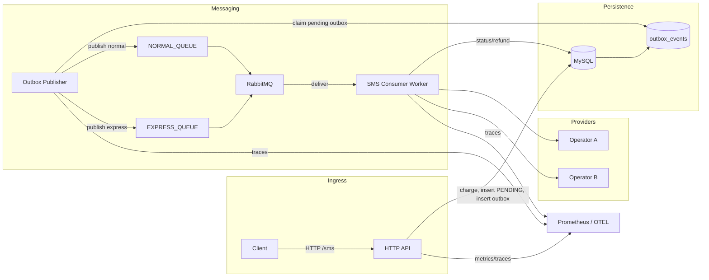
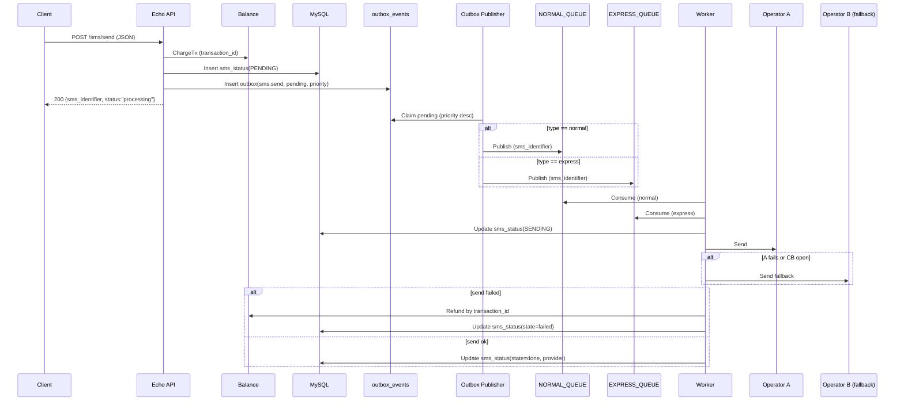
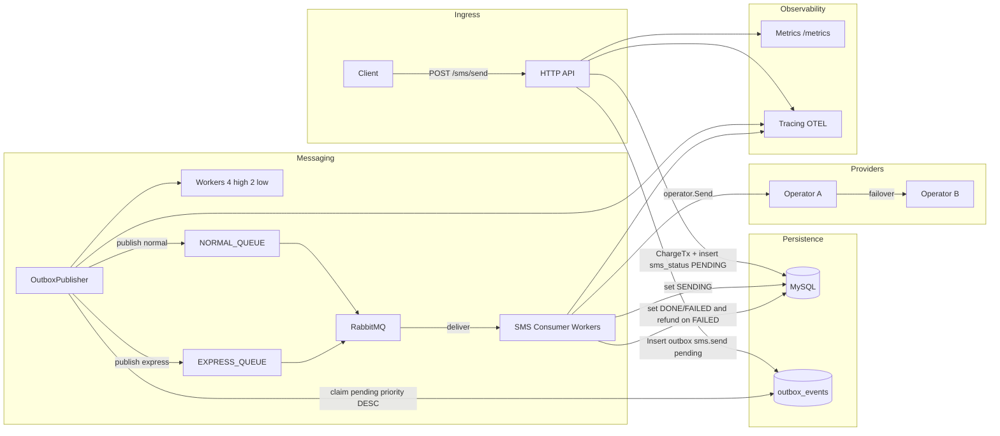

# SMS Gateway – Developer Guide

## Overview
- Full-stack observability: metrics for HTTP/DB/RabbitMQ, structured JSON logs, OpenTelemetry tracing.
- Robustness: graceful shutdown for server + workers, panic recovery middleware, balance refund on provider failure.
- Message flow: **Transactional outbox** for reliable publish, RabbitMQ for async delivery, MySQL for balance/transactions/history, operator failover with circuit breaker.

A small SMS gateway service that exposes HTTP APIs, manages user balance, writes SMS requests to an **outbox** (pending), publishes them to RabbitMQ via an outbox worker, processes delivery via operators with circuit breaker failover, and persists traces/metrics. Built with Go, Echo, MySQL, RabbitMQ, OpenTelemetry, and Prometheus-compatible metrics.

## Architecture
- API: Echo HTTP server (`cmd/api/main.go`) with JSON logging (slog), tracing middleware, metrics endpoint, and panic recovery.
- Balance: Reads/updates user balances and transactions (`internal/balance`).
- SMS: Accepts send requests, debits balance, writes **sms_status (PENDING)** + **outbox_events (pending)**, exposes history (`internal/sms`).
- Outbox publisher: Polls `outbox_events` and publishes to RabbitMQ with priority worker pools (`internal/sms/outbox_publisher.go`).
- Queue consumers: Consume Rabbit messages and call `sendSms` (`internal/sms/consumer.go`).
- Operators: Provider failover with circuit breaker (`internal/operator`, `pkg/circuitbreaker`).
- Observability: OpenTelemetry tracing (`pkg/tracing`), metrics (`pkg/metrics`), structured logs (`app.Logger`).

### High-level flow


### Components and responsibilities
- **`app/`**: Application bootstrap (config, logger, tracing, DB, Rabbit, Echo middlewares including recover).
- **`cmd/api/main.go`**: Route wiring, graceful shutdown, consumer start.
- **`internal/balance`**: Balance checks, deductions, refunds, history (transactions table).
- **`internal/sms`**: Send handler, history query, worker `sendSms` writes `sms_status`, refunds on failure.
- **`internal/operator`**: Sends to OperatorA then fails over to B via circuit breaker.
- **`pkg/queue`**: Rabbit connection/publish/consumer setup.
- **`pkg/metrics`**: Echo middleware and Prometheus exposition.
- **`pkg/tracing`**: OpenTelemetry exporter init and helpers.

## Routes
- **POST /sms/send**: Charge balance and **enqueue via outbox** (no direct Rabbit publish in handler).
  - Example:
    ```bash
    curl --location 'http://localhost:8080/sms/send' \
      --header 'Content-Type: application/json' \
      --data '{
        "customer_id": 1,
        "text": "hi",
        "recipients": [
          "09128582812",
          "091285284834"
        ],
        "type": "normal"
      }'
    ```
- **GET /sms/history**: SMS status history with optional filters.
  - Example:
    ```bash
    curl --location 'localhost:8080/sms/history?user_id=1&status=pending&sms_identifier=88636fb2-dd01-42a4-a718-1fe200683a45'
    ```
- **GET /balance**: Current balance + transactions.
  - Example:
    ```bash
    curl "http://localhost:8080/balance?user_id=1"
    ```
- **POST /balance/add**: Add balance and record transaction.
  - Example:
    ```bash
    curl -X POST http://localhost:8080/balance/add \
      -H 'Content-Type: application/json' \
      -d '{"user_id":1,"balance":100,"description":"top-up"}'
    ```
- **GET /swagger/***: Swagger UI (served by the API)
- **GET /metrics**: Prometheus metrics.

Routing by type: normal SMS → `NORMAL_QUEUE`; express SMS → `EXPRESS_QUEUE`.

Swagger UI default URL (adjust port to your `LISTEN_ADDR`): `http://localhost:8080/swagger/index.html`
- **Postman collection:** `postman/collections/Arvan.postman_collection.json`

## SMS state machine
- **PENDING**: inserted during `/sms/send` (alongside outbox insert)
- **SENDING**: set by consumer right before calling `operator.Send`
- **DONE**: set on successful provider send
- **FAILED**: set on failure (and balance refund is applied)

State flow:

```
PENDING → SENDING → DONE
               ↘ FAILED
```

## Outbox priority + worker pools
- **Express** messages are inserted to outbox with higher `priority` (default: 10).
- **Normal** messages use lower priority (default: 0).
- The outbox publisher runs **4 workers for high priority** and **2 for low priority** and claims work with `FOR UPDATE SKIP LOCKED`.


## Data model (SQL)
```sql
CREATE TABLE user_balances (
    id BIGINT PRIMARY KEY AUTO_INCREMENT,
    user_id BIGINT NOT NULL UNIQUE,
    balance BIGINT NOT NULL DEFAULT 0,
    last_updated DATETIME NOT NULL DEFAULT CURRENT_TIMESTAMP ON UPDATE CURRENT_TIMESTAMP
) ENGINE=InnoDB;

CREATE TABLE user_transactions (
    id BIGINT PRIMARY KEY AUTO_INCREMENT,
    user_id BIGINT NOT NULL,
    amount BIGINT NOT NULL,
    transaction_type VARCHAR(50) NOT NULL,
    description TEXT,
    transaction_id VARCHAR(50) NOT NULL UNIQUE,
    created_at DATETIME NOT NULL DEFAULT CURRENT_TIMESTAMP,
    INDEX idx_user_transactions_user_id (user_id, created_at)
) ENGINE=InnoDB;

CREATE TABLE sms_status (
    id BIGINT PRIMARY KEY AUTO_INCREMENT,
    user_id BIGINT NOT NULL,
    status VARCHAR(50) NOT NULL,
    type VARCHAR(50) NOT NULL,
    recipient VARCHAR(20) NOT NULL,
    provider VARCHAR(50) NOT NULL DEFAULT '',
    sms_identifier VARCHAR(50) NOT NULL,
    created_at DATETIME NOT NULL DEFAULT CURRENT_TIMESTAMP,
    updated_at DATETIME NOT NULL DEFAULT CURRENT_TIMESTAMP ON UPDATE CURRENT_TIMESTAMP,
    UNIQUE KEY uq_sms_status_identifier_recipient (sms_identifier, recipient),
    INDEX idx_sms_status_user_identifier (user_id, sms_identifier),
    INDEX idx_sms_status_user_status_created (user_id, status, created_at)
) ENGINE=InnoDB;

CREATE TABLE outbox_events (
    id BIGINT PRIMARY KEY AUTO_INCREMENT,
    aggregate_type VARCHAR(50) NOT NULL,
    aggregate_id VARCHAR(50) NOT NULL,
    event_type VARCHAR(100) NOT NULL,
    payload JSON NOT NULL,
    priority INT NOT NULL DEFAULT 0,
    status VARCHAR(20) NOT NULL DEFAULT 'pending',
    attempts INT NOT NULL DEFAULT 0,
    next_run_at DATETIME NULL,
    last_error TEXT NULL,
    created_at DATETIME NOT NULL DEFAULT CURRENT_TIMESTAMP,
    updated_at DATETIME NOT NULL DEFAULT CURRENT_TIMESTAMP ON UPDATE CURRENT_TIMESTAMP,
    UNIQUE KEY uq_outbox_aggregate_event (aggregate_id, event_type),
    INDEX idx_outbox_pending (status, priority, next_run_at, created_at)
) ENGINE=InnoDB;
```

## Request lifecycle: `/sms/send`


## Worker processing (simplified)
1. Outbox publisher claims `outbox_events` and publishes to Rabbit.
2. Consumer consumes from RabbitMQ queue.
3. Deserialize `model.SMS`.
4. `sendSms`: update `sms_status` to **SENDING**, call `operator.Send` (A then B with circuit breaker), on failure mark **FAILED** + refund, on success mark **DONE** with provider.

## Circuit breaker + failover
- Implemented in `pkg/circuitbreaker` and used by `internal/operator.Send`.
- Attempts OperatorA first; on failure or open breaker, routes to OperatorB.


## Running locally
- Build: `make build`
- Run API: `make run`
- Tests: `make test`
- Lint: `make lint`
- Swagger docs: `make swag`
- Docker (app + deps): `make docker`
- Load test seed (fast DB seed): `make seed`
- Load test traffic: `make loadtest`

Or manually:
```bash
go run ./cmd/api
```

## Docker & Compose
- `Dockerfile` builds the Go service (see root).
- `docker-compose.yml` brings up MySQL, RabbitMQ (management UI on :15672), and the app.
```bash
docker compose up --build
```
App listens on `:8080` by default; metrics at `/metrics`; swagger at `/swagger/index.html`.

## Capacity knobs
DB connection pooling can be tuned via env:
- `DB_MAX_OPEN_CONNS` (default 50)
- `DB_MAX_IDLE_CONNS` (default 25)
- `DB_CONN_MAX_LIFETIME_SEC` (default 300)


### Load test tips
- Seed once: `make seed`
- Then run traffic: `make loadtest`
- If you want slow, API-only seeding: `go run ./cmd/loadtest -seed-only -seed-method http ...`

## Observability
- **Logs**: Structured JSON via slog to stdout.
- **Tracing**: OpenTelemetry exporter configured by env; spans include user_id where available.
- **Metrics**: `GET /metrics` Prometheus endpoint; DB ops and HTTP middleware instrumented.

## Error handling
- Echo recover middleware guards panics.
- Domain errors bubble via handlers to appropriate HTTP codes (payment required for insufficient balance).
- Worker refunds balance on provider failure.

## Testing
- Unit/integration tests use `testcontainers` for MySQL/Rabbit in `testutil/`.
- Balance & SMS logic covered under `internal/.../*_test.go`.
- Run: `go test ./...`

## Diagrams (service context)

