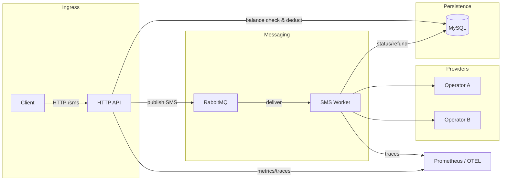
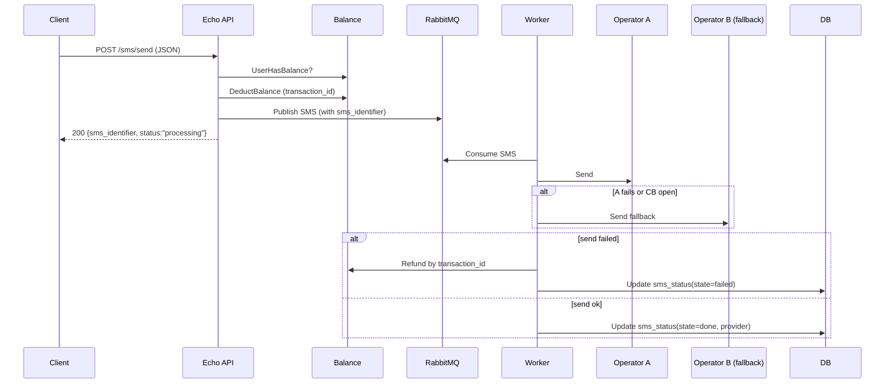
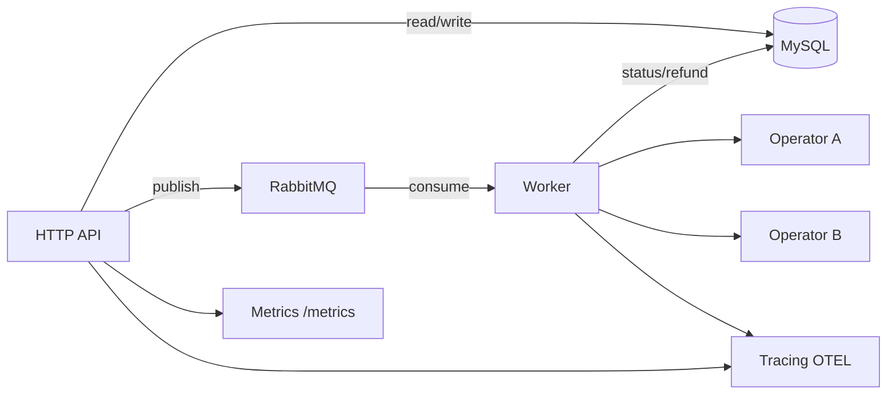

# SMS Gateway – Developer Guide

## Overview
A small SMS gateway service that exposes HTTP APIs, manages user balance, enqueues SMS to RabbitMQ, processes delivery via operators with circuit breaker failover, and persists traces/metrics. Built with Go, Echo, MySQL, RabbitMQ, OpenTelemetry, and Prometheus-compatible metrics.

## Architecture
- API: Echo HTTP server (`cmd/api/main.go`) with JSON logging (slog), tracing middleware, metrics endpoint, and panic recovery.
- Balance: Reads/updates user balances and transactions (`internal/balance`).
- SMS: Accepts send requests, debits balance, enqueues messages, updates status table, exposes history (`internal/sms`).
- Operators: Provider failover with circuit breaker (`internal/operator`, `pkg/circuitbreaker`).
- Queue: RabbitMQ connection & worker (`pkg/queue`, `internal/sms/consumer.go`).
- Observability: OpenTelemetry tracing (`pkg/tracing`), metrics (`pkg/metrics`), structured logs (`app.Logger`).

### High-level flow


### Components and responsibilities
- **`app/`**: Application bootstrap (config, logger, tracing, DB, Rabbit, Echo middlewares including recover).
- **`cmd/api/main.go`**: Route wiring, graceful shutdown, consumer start.
- **`internal/balance`**: Balance checks, deductions, refunds, history (transactions table).
- **`internal/sms`**: Send handler, history query, worker `sendSms` writes `sms_status`, refunds on failure.
- **`internal/operator`**: Sends to OperatorA then fails over to B via circuit breaker.
- **`pkg/queue`**: Rabbit connection/publish/consumer setup.
- **`pkg/metrics`**: Echo middleware and Prometheus exposition.
- **`pkg/tracing`**: OpenTelemetry exporter init and helpers.

## Routes
- **POST /sms/send**: Enqueue SMS after balance check and debit.
  - Example:
    ```bash
    curl -X POST http://localhost:8080/sms/send \
      -H 'Content-Type: application/json' \
      -d '{"customer_id":1,"type":"normal","recipients":["+12025550123"],"content":"hi"}'
    ```
- **GET /sms/history**: SMS status history with optional filters.
  - Example:
    ```bash
    curl "http://localhost:8080/sms/history?user_id=1&status=done"
    ```
- **GET /balance**: Current balance + transactions.
  - Example:
    ```bash
    curl "http://localhost:8080/balance?user_id=1"
    ```
- **POST /balance/add**: Add balance and record transaction.
  - Example:
    ```bash
    curl -X POST http://localhost:8080/balance/add \
      -H 'Content-Type: application/json' \
      -d '{"user_id":1,"balance":100,"description":"top-up"}'
    ```
- **GET /swagger/***: Swagger UI (served by the API)
- **GET /metrics**: Prometheus metrics.

- **Swagger UI**  (adjust port to your `LISTEN_ADDR`): `http://localhost:8080/swagger/index.html`
- **Postman collection:** `postman/collections/Arvan.postman_collection.json`


## Data model (SQL)
```sql
CREATE TABLE user_balances (
    id BIGINT PRIMARY KEY AUTO_INCREMENT,
    user_id BIGINT NOT NULL UNIQUE,
    balance BIGINT NOT NULL DEFAULT 0,
    last_updated DATETIME NOT NULL DEFAULT CURRENT_TIMESTAMP ON UPDATE CURRENT_TIMESTAMP
) ENGINE=InnoDB;

CREATE TABLE user_transactions (
    id BIGINT PRIMARY KEY AUTO_INCREMENT,
    user_id BIGINT NOT NULL,
    amount BIGINT NOT NULL,
    transaction_type VARCHAR(50) NOT NULL,
    description TEXT,
    transaction_id VARCHAR(50) NOT NULL UNIQUE,
    created_at DATETIME NOT NULL DEFAULT CURRENT_TIMESTAMP,
    INDEX idx_user_transactions_user_id (user_id)
) ENGINE=InnoDB;

CREATE TABLE sms_status (
    id BIGINT PRIMARY KEY AUTO_INCREMENT,
    user_id BIGINT NOT NULL,
    status VARCHAR(50) NOT NULL,
    type VARCHAR(50) NOT NULL,
    recipient VARCHAR(20) NOT NULL,
    provider VARCHAR(50) NOT NULL DEFAULT '',
    sms_identifier VARCHAR(50) NOT NULL,
    created_at DATETIME NOT NULL DEFAULT CURRENT_TIMESTAMP,
    updated_at DATETIME NOT NULL DEFAULT CURRENT_TIMESTAMP ON UPDATE CURRENT_TIMESTAMP,
    INDEX idx_sms_status_user_id (user_id),
    INDEX idx_sms_status_identifier (sms_identifier)
) ENGINE=InnoDB;
```

## Request lifecycle: `/sms/send`


## Worker processing (simplified)
1. Consume from RabbitMQ queue.
2. Deserialize `model.SMS`.
3. `sendSms`: mark `sms_status` init, call `operator.Send` (A then B with circuit breaker), on failure mark failed + refund, on success mark done with provider.

## Circuit breaker + failover
- Implemented in `pkg/circuitbreaker` and used by `internal/operator.Send`.
- Attempts OperatorA first; on failure or open breaker, routes to OperatorB.


## Running locally
- Build: `make build`
- Run API: `make run`
- Tests: `make test`
- Lint: `make lint`
- Swagger docs: `make swag`
- Docker (app + deps): `make docker`

Or manually:
```bash
go run ./cmd/api
```

## Docker & Compose
- `Dockerfile` builds the Go service (see root).
- `docker-compose.yml` brings up MySQL, RabbitMQ (management UI on :15672), and the app.
```bash
docker-compose up --build
```
App listens on `:8080` by default; metrics at `/metrics`; swagger at `/swagger/index.html`.

## Observability
- **Logs**: Structured JSON via slog to stdout.
- **Tracing**: OpenTelemetry exporter configured by env; spans include user_id where available.
- **Metrics**: `GET /metrics` Prometheus endpoint; DB ops and HTTP middleware instrumented.

## Error handling
- Echo recover middleware guards panics.
- Domain errors bubble via handlers to appropriate HTTP codes (payment required for insufficient balance).
- Worker refunds balance on provider failure.

## Testing
- Unit/integration tests use `testcontainers` for MySQL/Rabbit in `integration/testutil`.
- Balance & SMS logic covered under `internal/.../*_test.go`.
- Run: `go test ./...`

## Diagrams (service context)

